# Window Server 管理


## 一、需求整理

1. 需要管理的机器有 windows server2003 、windows server 2008r2 、windows server 2012；
2. 在windows server 2003 服务器上安装好cygwin，通过cygwin来安装ssh并实现开机自动启动，并通过ssh连接后执行一些命令来管理windows server 2003R2的软件包安装；
3. 通过ansible管理windows server 2008r2 、windows server 2012；
4. powershell的基础用法，升级powershell版本，升级.NET Framework；
5. 使用ansible来管理Windows升级和软件包；


## 二、Windows Server 2003 R2

### 2.1 Windows Server 2003 R2 安装 Cygwin

由于windows server 2003R2比较久远，所以需要使用老版本Cygwin的setup才可以运行，如果直接在cygwin官网下载最新的就直接运行的话会提示版本不支持。所以找到一个老版本的镜像，可以直接离线进行安装使用。全部的安装使用过程如下：

1. 上传`Cygwin-Release-20061108.iso`到 Windows server 2003R2 中后解压

   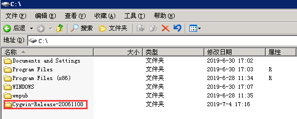

2. 进入解压后的目录，双击 `setup.exe` 运行程序

3. 点击下一步

   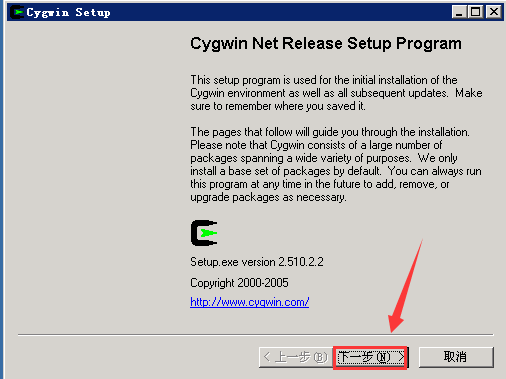

4. 选择从本地目录安装

   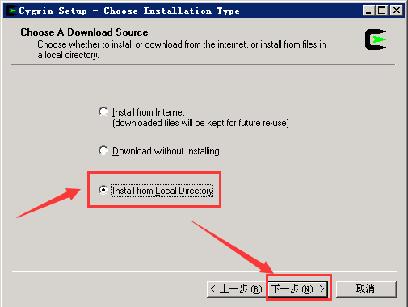

5. 默认选择好，点击下一步

   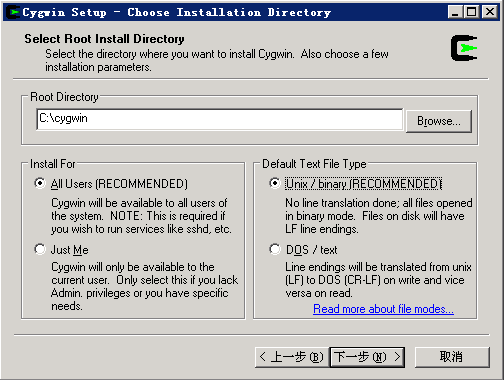

6. 选择好之前解压好的文件夹路径，点击下一步

   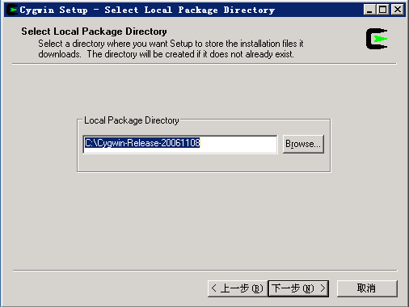

7. 进入到了选择需要安装包的界面

   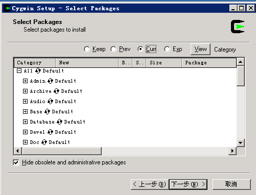

8. 勾选上以下这些包

   Devel > binutils：...  
   Devel > gcc-core：...  （会自动再勾选上gcc-mingw-core）  
   Devel > gcc-g++：...      (会自动再勾选上gcc-mingw-g++)  
   Devel > gdb：...  
   Net > openssh  （这个是重点，勾选上这个也会自动勾选上其他两个相关的）

9. 勾选好上面指定的包之后点击下一步

10. 静等安装好那些包后会弹出提示，点击完成

    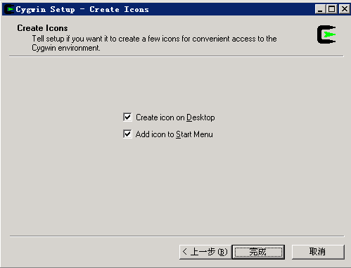

11. 提示安装完毕了

    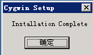

12. 将cygwin添加到系统环境变量中去

    `C:\cygwin\bin` 和 `C:\cygwin\usr\sbin` 这两个路径，操作方法（略）

13. 点击桌面的cygwin图标，启动成功

    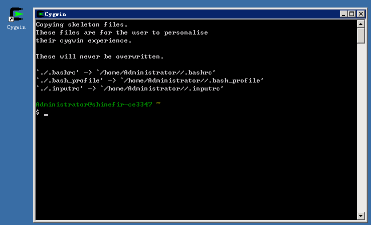

### 2.2 cygwin安装启动ssh

1. 启动cygwin之后，输入 ssh-host-config 进行ssh服务的配置

   配置过程中需要交互的五个地方按照下面这样回应即可。

   ```
   should privilege separation be used? <yes/no>   yes
   
   Should this script create a local user 'sshd' on this machine? <yes/no>  yes
   
   Do you want to install sshd as service?
   <Say "no" if it's already installed as service> <yes/no>  yes
   
   Should this script create a new local account 'sshd_server' which has the required privileges? <yes/no>  no
   
   Default is "ntsec". CYGWIN=ntsec
   ```

   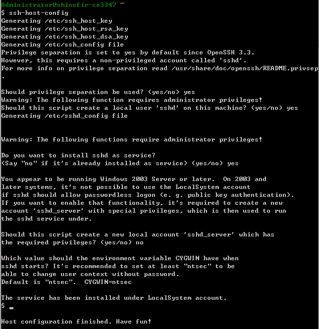

2. 启动sshd服务

   在配置完毕之后，可以使用 `net start sshd` 启动服务

   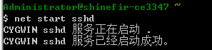

3. 设置sshd服务开机自动启动

   进入 控制面板 >> 管理工具 >> 服务，将 `CYGWIN sshd` 服务设置为自动

   

4. 在Linux的服务器中使用ssh测试是否能够成功连接到windows server中

   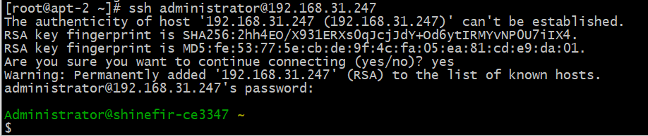

   根据测试看到是没有问题的。

### 2.3 Linux服务器使用ssh免密登录Windows Server 2003 R2

1. 在Linux服务器中生成密钥对

   使用`ssh-keygen`命令即可生成密钥对，后续全按回车即可

   ```bash
   [root@apt-2 ~]# ssh-keygen 
   Generating public/private rsa key pair.
   Enter file in which to save the key (/root/.ssh/id_rsa): 
   Enter passphrase (empty for no passphrase): 
   Enter same passphrase again: 
   Your identification has been saved in /root/.ssh/id_rsa.
   Your public key has been saved in /root/.ssh/id_rsa.pub.
   The key fingerprint is:
   SHA256:JjUKFuw1KBkTQA8fg4HRSx7kbhfL89XV5tPkOrn7NXE root@apt-2
   The key's randomart image is:
   +---[RSA 2048]----+
   |=OBB..           |
   |.oX.=.o      .   |
   | o.B+. .o   . o .|
   | .oo.+ o o . o + |
   |  o = o S .   o.E|
   | . . o +       +o|
   |      .       +..|
   |               oo|
   |              oo.|
   +----[SHA256]-----+
   ```

2. 将公钥拷到windows服务器中

   ```bash
   [root@apt-2 ~]# ssh-copy-id -i /root/.ssh/id_rsa.pub administrator@192.168.31.247
   /usr/bin/ssh-copy-id: INFO: Source of key(s) to be installed: "/root/.ssh/id_rsa.pub"
   /usr/bin/ssh-copy-id: INFO: attempting to log in with the new key(s), to filter out any that are already installed
   /usr/bin/ssh-copy-id: INFO: 1 key(s) remain to be installed -- if you are prompted now it is to install the new keys
   administrator@192.168.31.247's password: 
   
   Number of key(s) added: 1
   
   Now try logging into the machine, with:   "ssh 'administrator@192.168.31.247'"
   and check to make sure that only the key(s) you wanted were added.
   ```

3. ssh连接测试

   直接使用ssh进行连接，可以测试到能够实现免密登录

   ```bash
   [root@apt-2 ~]# ssh administrator@192.168.31.247
   Last login: Thu Jul  4 18:02:57 2019 from 192.168.31.121
   
   Administrator@shinefir-ce3347 ~
   $ 
   ```

### 2.4 Windows Server 2003 SP2 安装msi文件

- 开启 Windows Installer 服务

  控制面板 >> 管理工具 >> 服务  
  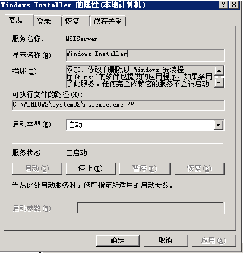

- 运行安装

  在Linux server端通过ssh连接到windows服务器的cygwin中，再进行切换到cmd使用命令来进行静默安装

  ```sh
  [root@apt-2 ~]# ssh administrator@192.168.31.247
  Last login: Sun Jul  7 20:18:51 2019 from 192.168.31.121
  
  Administrator@shinefir-ce3347 ~
  $ cd /cygdrive/c/softs/
  
  Administrator@shinefir-ce3347 /cygdrive/c/softs
  $ cmd
  Microsoft Windows [ 5.2.3790]
  (C)  1985-2003 Microsoft Corp.
  c:\softs>msiexec /i 7z920-x64.msi /qb /l*v test.log
  msiexec /i 7z920-x64.msi /qb /l*v test.log
  ```

  说明：/i表示安装，test.msi是MSI安装包的全路径。**/qb表示安静安装（不需要用户点下一步）**，/l*v表示输出日志到 test.log文件。

- 查看结果

  安装完毕后可以到7-zip的默认软件安装目录下去查看结果

  ```bash
  c:\softs>exit
  exit
  Administrator@shinefir-ce3347 /cygdrive/c/softs
  $ cd ../Program\ Files/7-Zip/
  
  Administrator@shinefir-ce3347 /cygdrive/c/Program Files/7-Zip
  $ ls
  7-zip.chm  7z.exe     7zFM.exe     Lang          readme.txt
  7-zip.dll  7z.sfx     7zG.exe      License.txt
  7z.dll     7zCon.sfx  History.txt  descript.ion
  ```

- 卸载msi安装的程序

### 2.5 Windows Server 2003 SP2 安装exe文件

- 运行安装

  Linux服务端通过ssh连接到windows客户端中，进入到相应的目录，再用cmd命令打开cmd程序，直接进行静默安装。

  ```sh
  [root@apt-2 ~]# ssh administrator@192.168.31.247
  Last login: Mon Jul  8 11:05:47 2019 from 192.168.31.121
  
  Administrator@shinefir-ce3347 ~
  $ cd /cygdrive/c/softs/
  
  Administrator@shinefir-ce3347 /cygdrive/c/softs
  $ ls 
  7z920.exe           
  
  Administrator@shinefir-ce3347 /cygdrive/c/softs
  $ mkdir 7zip
  
  Administrator@shinefir-ce3347 /cygdrive/c/softs
  $ cmd 
  Microsoft Windows [ 5.2.3790]
  (C)  1985-2003 Microsoft Corp.
  
  c:\softs>7z1604-x64.exe /S /D=c:\softs\7zip
  7z1604-x64.exe /S /D=c:\softs\7zip
  ```

  *注意：某些exe安装包可能会需要使用不一样的参数来进行静默安装，具体可以参考一下：<https://www.cnblogs.com/toor/p/4198061.html>*

- 查看结果

  等待执行命令运行一段时间后再到指定的`c:\softs\7zip`查看可以看到已经安装成功

  ```sh
  c:\softs>exit
  exit
  
  Administrator@shinefir-ce3347 /cygdrive/c/softs
  $ ls 7zip/
  7-zip.chm    7z.dll  7zCon.sfx  History.txt  Uninstall.exe
  7-zip.dll    7z.exe  7zFM.exe   Lang         descript.ion
  7-zip32.dll  7z.sfx  7zG.exe    License.txt  readme.txt
  ```


## 三、Windows Server 2008 R2 配置被ansible管理

1. 下载 `.NET Framework 4.5.1` 和 Powershell 3.0

   下载地址：  
   [.NET Framework 4.5.1](https://dotnet.microsoft.com/download/thank-you/net451>) 下载后的包名为：`NDP451-KB2859818-Web`  
   [Powershell3.0](<https://www.microsoft.com/en-us/download/details.aspx?id=34595>)    下载`Windows6.1-KB2506143-x64.msu`这个包即可

2. 运行 .net framework 升级包升级到4.5.1  

3. 运行 Windows6.1-KB2506143-x64.msu 升级包升级powershell到 3.0 版本，**升级完毕后需要重启**  

4. 开启powershell的脚本运行支持  

   1.管理员身份启动powershell，执行命令：`set-executionpolicy remotesigned`  
   2.HKEY_LOCAL_MACHINE\SOFTWARE\Microsoft\PowerShell\1\ShellIds\ScriptedDiagnostics 中的 ExecutionPolicy的数据改为`remotesigned`

5. 配置winrm

   下载脚本：https://github.com/ansible/ansible/blob/devel/examples/scripts/ConfigureRemotingForAnsible.ps1  
   在powershell中运行脚本  
   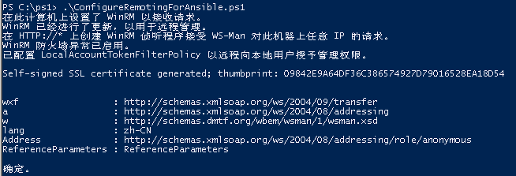

6. 查看winrm配置文件是否正确

   在powershell中输入 `winrm get winrm/config`  
   查看Auth中Basic设置是否为true，service中AllowUnencrypted设置是否为true  
   如果不为ture则需要进行配置

   ```
   > winrm set winrm/config/service '@{AllowUnencrypted="true"}'
   > winrm set winrm/config/service/auth '@{Basic="true"}'
   ```

7. 开启防火墙端口5986端口可被访问


## 四、Windows Server 2012 配置被ansible管理

略


## 五、CentOS7 安装使用Ansible管理Windows Server

### 5.1 安装与使用ansible

- 安装epel源

  ```bash
  [root@apt-2 ~]# yum -y install epel-release
  [root@apt-2 ~]# yum clean all 
  [root@apt-2 ~]# yum makecache
  ```

- yum安装一些必要包，kerberos，pywinrm

  ```bash
  [root@apt-2 ~]# yum -y install python2-pip gcc libgcc python-kerberos
  [root@apt-2 ~]# pip install http://github.com/diyan/pywinrm/archive/master.zip#egg=pywinrm
  ```

- 配置 /etc/ansible/hosts

  配置方式：  

  ```yaml
  [windows]
  192.168.31.6
  [windows:vars]
  ansible_user=administrator
  ansible_password=123456
  ansible_port=5986
  ansible_connection=winrm
  ansible_winrm_server_cert_validation=ignore
  ```

  要注意的是，端口方面ssl即https方式的使用5986，http使用5985


### 5.2 ansible模块使用测试

1. win_ping

   ```bash
   $ ansible windows -m win_ping
   192.168.1.11 | SUCCESS => {
       "changed": false, 
       "ping": "pong"
   }
   ```

### 5.3 解决中文乱码

在使用win_shell的时候，一些命令执行完返回的中文会是乱码，需要修改winrm模块

```bash
[root@apt-2 ~]# sed -i "s#tdout_buffer.append(stdout)#tdout_buffer.append(stdout.decode('gbk').encode('utf-8'))#g" /usr/lib/python2.7/site-packages/winrm/protocol.py
[root@apt-2 ~]# sed -i "s#stderr_buffer.append(stderr)#stderr_buffer.append(stderr.decode('gbk').encode('utf-8'))#g" /usr/lib/python2.7/site-packages/winrm/protocol.py
```

*P.S.这个方法不能保证100%有效，但是是目前能找到唯一的解决方法... 另外还有个是说修改ansible.cfg配置文件的，但是那个解决的好像是另外一个编码问题* 

### 5.4 通过 win_package 模块在windows中安装软件

- 安装msi

  在ansible服务端编写如下playbook运行即可安装7-zip.msi程序

  ```yaml
  ---
  - hosts: windows
  
    tasks:
    - name: send files to windows
      win_copy:
        src: /softs/7z920-x64.msi
        dest: C:\softs\
  
    - name: Create directory structure
      win_file:
        path: C:\softs\7zip
        state: directory
  
    - name: install 7zip.msi
      win_package:
        path: C:\softs\7z920-x64.msi
        state: present
        log_path: C:\softs\7zip_install.log
  ```

- 安装exe

  在ansible服务端编写如下playbook运行即可安装npp.exe

  ```yaml
  ---
  - hosts: windows
  
    tasks:
    - name: send files to windows
      win_copy:
        src: /softs/npp.exe
        dest: C:\softs\
  
    - name: Create directory structure
      win_file:
        path: C:\softs\npp
        state: directory
  
    - name: install the npp.exe
      win_package:
        path: C:\softs\npp.exe
        product_id: npp
        arguments:
          /S
          /D=c:\softs\npp
        state: present
  ```

### 5.5 通过win_updates实现Windows updates

在windows server 2008R2中安装更新的playbook如下：

```yaml
---
- hosts: windows
  tasks: 
  - name: Install all security, critical, and rollup updates without a scheduled task
    win_updates:
      category_names:
        - SecurityUpdates
        - CriticalUpdates
        - UpdateRollups
      reboot: yes
      log_path: C:\softs\ansible_updates_log.txt
```

### 5.6 文件传输设计

#### 初期文件传输

使用Samba服务来进行前期一些软件包的传输，例如windows server 2003 R2的cygwin离线安装包等；  
等前期ssh，ansible之类的配置完成好了就可以使用更加便捷的方式来进行文件传输了。

1. 安装Samba服务

   ```bash
   [root@apt-2 /]# yum -y install samba
   ```

2. 配置Samba服务

   配置 smb.conf 文件

   ```bash
   [root@apt-2 ~]# vim /etc/samba/smb.conf
   [global]
           workgroup = WORKGROUP
           server string = Samba Server Version %v
           security = user
           passdb backend = tdbsam
           load printers = yes
           cups options = raw
   
   [myshare]
           comment = share for users
           path = /samba
           browseable = yes
           writable = yes
           public = no
   ```

   创建相应的目录以及权限分配

   ```
   [root@apt-2 ~]# mkdir /samba/
   [root@apt-2 /]# chmod 777 samba/ -R     
   [root@apt-2 /]# useradd smbuser1
   ```

3. 使用Samba服务

   在windows中的资源管理器地址栏输入 `\\IP` 进入Samba的服务地址，输入创建好的用户密码即可进入

   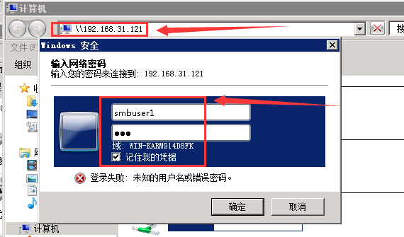

   可以看到服务端的文件夹

   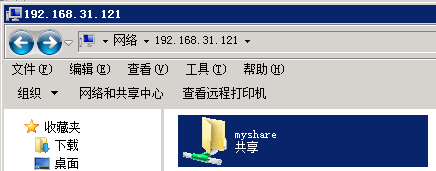

#### 后期文件传输

**Windows server 2003R2**

对于windows server 2003R2，由于是直接使用ssh来进行传输的，所以文件传输，使用服务端直接进行scp来传输文件是一个很高效简单的方式

在Linux服务端的操作：

```bash
[root@apt-2 ~]# scp testfile  administrator@192.168.31.247:/cygdrive/c/softs 
testfile                                          100%    0     0.0KB/s   00:00  
```

远程到windows server 2003R2服务器中查看结果：

```sh
# ssh administrator@192.168.31.247
Last login: Fri Jul  5 10:12:48 2019 from 192.168.31.121

Administrator@shinefir-ce3347 ~
$ ls 
testfile
```

**Windows server 2008 +**

由于 `windows server 2008r2` 与 `windows server 2012` 是可以被ansible管理，所以可以直接在Linux服务端中使用ansible的 `win_copy` 模块即可实现文件的传输

```bash
$ ansible windows -m win_copy -a "src=/etc/passwd dest=c:\share"
192.168.1.11 | SUCCESS => {
    "changed": true, 
    "checksum": "a82c2bd7de3d9a5c5adddd5e4fc7cbf1703720b7", 
    "operation": "file_copy", 
    "original_basename": "passwd", 
    "size": 1755
}
```


