# ELK日志分析系统


```
Author：apt
Date：2019/01/14
Version:1.0
Usage：用于友和道通集团部署测试ELK日志分析系统的文档
```


[ELK简介](#一、ELK简介)


## 一、ELK简介

### 什么是ELK？

引用一段官方的话：

> what is the ELK ?
> 
> "ELK" is the acronym for three open source projects: Elasticsearch,  Logstash, and Kibana. Elasticsearch is a search and analytics engine.  Logstash is a server‑side data processing pipeline that ingests data  from multiple sources simultaneously, transforms it, and then sends it  to a "stash" like Elasticsearch. Kibana lets users visualize data with  charts and graphs in Elasticsearch. 
>
> The Elastic Stack is the next evolution of the ELK Stack.  

ELK主要是由3个开源项目组成的：elasticsearch，logstash，kibana


### ELK工作原理介绍

如下图：Logstash收集AppServer产生的Log，并存放到ElasticSearch集群中，而Kibana则从ES集群中查询数据生成图表，再返回给Browser


### ELK功能介绍


### ELK组件介绍

##### Elasticsearch

Elasticsearch是个开源分布式搜索引擎，提供**搜集**、**分析**、**存储数据**三大功能。它的特点有：分布式，零配置，自动发现，索引自动分片，索引副本机制，restful风格接口，多数据源，自动搜索负载等。

我觉得他们的广告说得挺好的，`简单的事情就该简单做`。


通过与Hadoop协作，


##### Logstash

Logstash 主要是用来日志的搜集、分析、过滤日志的工具，支持大量的数据获取方式。一般工作方式为c/s架构，client端安装在需要收集日志的主机上，server端负责将收到的各节点日志进行过滤、修改等操作在一并发往elasticsearch上去。


##### Kibana

Kibana 也是一个开源和免费的工具，Kibana可以为 Logstash 和 ElasticSearch 提供的日志分析友好的 Web 界面，可以帮助汇总、分析和搜索重要数据日志。


##### Beats

Beats 是一个面向轻量型采集器的平台，这些采集器可从边缘机器向 Logstash 和 Elasticsearch 发送数据。


### ELK elasticsearch 核心术语

参考：http://www.ttlsa.com/elk/elk-elasticsearch-core-concept/


- NRT

- 集群

- 节点

- 索引

- 类型

- 文档

- 分片和副本


## 二、规划/需求
### 服务器规划

#### 服务器架构设计：（暂无）


### 环境规划（测试环境）


#### 初步测试架构


#### 操作系统

RHEL 7.4


#### 服务器硬件配置信息

elasticsearch : 2C4G  '/'分区200G   '/data'分区1TB

logstash : 2C4G 200G

kibana : 2C4G 200G


#### Docker

暂未使用


#### JDK

jdk-8u201（1.8x）

**注意：**jdk的版本选择取决于elastic的版本，elastic5.x以上用1.8，5.x以下用1.6或者1.7	


### 软件版本选择（都使用了最新版）

#### Elasticsearch 6.5.4

#### Logstash 6.5.4

#### Kibana 6.5.4

#### filebeat 6.5.4


## 三、ELK日志分析系统的部署

### 单机部署

​        由于这里是先用于测试的ELK日志分析系统，所以最后决定只使用一台机器来做测试，也就是把ELK所有的组件集成安装到了这一台服务器上面。


#### 主机的优化/配置等

- 关闭防火墙
- 修改SELinux


#### 安装JDK

- #####  下载官方的jdk rpm包进行安装

1. 进入[Oracle官网](https://www.oracle.com/index.html)的https://www.oracle.com/technetwork/java/javase/downloads/jdk8-downloads-2133151.html中找到合适的jdk的rpm包，然后点击右键后选择`复制链接地址`


2. 然后在需要安装ELK的服务器中执行以下命令下载rpm包到服务器中：

   ```bash
   # cd /usr/local/src
   # wget --no-check-certificate --no-cookies --header "Cookie: oraclelicense=accept-securebackup-cookie" https://download.oracle.com/otn-pub/java/jdk/8u201-b09/42970487e3af4f5aa5bca3f542482c60/jdk-8u201-linux-x64.rpm
   ```

   > 注：
   >
   > wget命令需要加入这个参数 --no-check-certificate --no-cookies --header "Cookie: oraclelicense=accept-securebackup-cookie"  否则会直接只下载一个网页文件，不会下载到真正想要的rpm包文件


3. 安装rpm包：

   ```bash
   # yum -y localinstall jdk-8u201-linux-x64.rpm
   ```

4. 查看Java版本

   ```bash
   # java -version 
   java version "1.8.0_201"
   Java(TM) SE Runtime Environment (build 1.8.0_201-b09)
   Java HotSpot(TM) 64-Bit Server VM (build 25.201-b09, mixed mode)
   ```


- ##### 也可以使用yum源安装openjdk

1. 检查yum源中是否含有1.8x版本的openjdk

   ```bash
   # yum list | grep openjdk 
   ```

2. 检查到有的话直接进行yum安装openjdk

   ```bash
   # yum -y install java-1.8.0-openjdk
   ```

3. 检查Java版本

   ```bash
   # java -version
   openjdk version "1.8.0_191"
   OpenJDK Runtime Environment (build 1.8.0_191-b12)
   OpenJDK 64-Bit Server VM (build 25.191-b12, mixed mode)
   ```

> 注：
>
> 由于openJDK去掉了JDK中涉及一些版权问题的API，所以会导致功能没有jdk那么完整，有可能会遇到一些问题，稳定性可能没那么好，所以并不推荐这个方式


#### 安装Elasticsearch

这里测试就直接安装最新版本的elasticsearch，并且为了方便管理，采用的是源码安装的方式。

安装步骤如下：

1. 进入elasticsearch的下载页面，在浏览器地址栏中输入：`https://www.elastic.co/downloads/elasticsearch`，选择下载tar.gz包格式，鼠标右键复制连接地址。

   

2. 在需要安装elasticsearch的服务器中执行下列命令获取tar.gz包

   ```bash
   # wget -O /usr/local/src/elasticsearch.tar.gz https://artifacts.elastic.co/downloads/elasticsearch/elasticsearch-6.5.4.tar.gz
   ```

3. 创建一个安装elasticsearch的目录并把文件解压到指定这个指定的目录

   ```bash
   # mkdir -p /usr/local/elasticsearch && tar xzvf /usr/local/src/elasticsearch.tar.gz  -C /usr/local/elasticsearch/ --strip-components 1
   ```

4. 备份配置文件elasticsearch.yml 

   ```bash
   # cp /usr/local/elasticsearch/config/elasticsearch.yml /usr/local/elasticsearch/config/elasticsearch.yml.default
   ```

5. 修改配置文件elasticsearch.yml，修改后的文件内容如下

   ```yml
   # vim /usr/local/elasticsearch/config/elasticsearch.yml
   cluster.name: elk-application
   node.name: node-1
   path.data: /data/elasticsearch/data
   path.logs: /data/elasticsearch/logs
   network.host: 10.0.0.179
   http.port: 9200
   discovery.zen.ping.unicast.hosts: ["node-1"]
   discovery.zen.minimum_master_nodes: 1
   ```

6. 创建elasticsearch用户，并给安装目录授权，因为不能直接用root用户启动

   ```bash
   # useradd elasticsearch 
   # chown -R elasticsearch.elasticsearch /data/elasticsearch/
   # chown -R elasticsearch.elasticsearch /usr/local/elasticsearch/
   ```

7. 修改sysctl.conf文件，添加一个vm.max_map_count参数（查了一下添加这个参数的数值是为了避免之后可能会报错说`max virtual memory areas vm.max_map_count [65530] is too low`）

   ```bash
   # echo "vm.max_map_count = 262144" >> /etc/sysctl.conf 
   # sysctl -p
   net.ipv6.conf.all.disable_ipv6 = 1
   net.ipv6.conf.default.disable_ipv6 = 1
   net.ipv6.conf.lo.disable_ipv6 = 1
   vm.swappiness = 0
   net.ipv4.neigh.default.gc_stale_time = 120
   net.ipv4.conf.all.rp_filter = 0
   net.ipv4.conf.default.rp_filter = 0
   net.ipv4.conf.default.arp_announce = 2
   net.ipv4.conf.lo.arp_announce = 2
   net.ipv4.conf.all.arp_announce = 2
   net.ipv4.tcp_max_tw_buckets = 5000
   net.ipv4.tcp_syncookies = 1
   net.ipv4.tcp_max_syn_backlog = 1024
   net.ipv4.tcp_synack_retries = 2
   kernel.sysrq = 1
   vm.max_map_count = 262144
   ```

8. 修改 /etc/security/limits.conf 文件，修改打开文件句柄如下：

   ```
   *              soft    nofile          100000
   *              hard    nofile          100000
   *              soft    nproc          100000
   *              hard    nproc          100000
   ```

9. 添加信息ip和name到hosts文件，如下：

   ```bash
   # echo "10.0.0.179 node-1" >> /etc/hosts
   ```

10. 启动elasticsearch

    先切换到elasticsearch用户再进行启动，`nohup是一个比较简单的后台运行命令，之后会进行更多更高阶的启动使用`。

    ```bash
    # su - elasticsearch 
    $ nohup /usr/local/elasticsearch/bin/elasticsearch &>/dev/null & 
    ```

11. 检查验证elasticsearch的启动

    使用ps命令查看进程

    ```bash
    $ ps aux | grep elasticsearch 
    root      3736  0.0  0.0 189712  2340 pts/3    S    15:02   0:00 su - elasticsearch
    elastic+  4208  175 14.4 3625492 1158728 pts/1 Sl   15:08   0:03 /bin/java -Xms1g -Xmx1g -XX:+UseConcMarkSweepGC -XX:CMSInitiatingOccupancyFraction=75 -XX:+UseCMSInitiatingOccupancyOnly -XX:+AlwaysPreTouch -Xss1m -Djava.awt.headless=true -Dfile.encoding=UTF-8 -Djna.nosys=true -XX:-OmitStackTraceInFastThrow -Dio.netty.noUnsafe=true -Dio.netty.noKeySetOptimization=true -Dio.netty.recycler.maxCapacityPerThread=0 -Dlog4j.shutdownHookEnabled=false -Dlog4j2.disable.jmx=true -Djava.io.tmpdir=/tmp/elasticsearch.UFomLl1j -XX:+HeapDumpOnOutOfMemoryError -XX:HeapDumpPath=data -XX:ErrorFile=logs/hs_err_pid%p.log -XX:+PrintGCDetails -XX:+PrintGCDateStamps -XX:+PrintTenuringDistribution -XX:+PrintGCApplicationStoppedTime -Xloggc:logs/gc.log -XX:+UseGCLogFileRotation -XX:NumberOfGCLogFiles=32 -XX:GCLogFileSize=64m -Des.path.home=/usr/local/elasticsearch -Des.path.conf=/usr/local/elasticsearch/config -Des.distribution.flavor=default -Des.distribution.type=tar -cp /usr/local/elasticsearch/lib/* org.elasticsearch.bootstrap.Elasticsearch
    elastic+  4262  0.0  0.0  63940  5116 pts/1    Sl   15:08   0:00 
    ```

12. 简单的curl测试

    正常运行的时候会显示下面这样的内容，否则会直接提示 Connection refused

    ```bash
    # curl 10.0.0.179:9200
    {
      "name" : "node-1",
      "cluster_name" : "elk-application",
      "cluster_uuid" : "ppy7POkXR8qhocSvAhkaog",
      "version" : {
        "number" : "6.5.4",
        "build_flavor" : "default",
        "build_type" : "tar",
        "build_hash" : "d2ef93d",
        "build_date" : "2018-12-17T21:17:40.758843Z",
        "build_snapshot" : false,
        "lucene_version" : "7.5.0",
        "minimum_wire_compatibility_version" : "5.6.0",
        "minimum_index_compatibility_version" : "5.0.0"
      },
      "tagline" : "You Know, for Search"
    }
    ```


#### 安装Logstash与filebeat

&nbsp;        filebeat用于在各个服务器上获取数据，发送到logstash上，再由logstash处理数据。

1. 在官网的Logstash下载页面中，获取tar.gz包的下载链接

2. 在服务器中使用wget下载tar包

   ```bash
   # wget -O /usr/local/src/logstash.tar.gz  https://artifacts.elastic.co/downloads/logstash/logstash-6.5.4.tar.gz
   ```

3. 解压

   ```bash
   # mkdir -p /usr/local/logstash && tar xzvf /usr/local/src/logstash.tar.gz -C /usr/local/logstash/ --strip-components 1
   ```

 4. **安装filebeat**

       1. 在官网中获取filebeat的下载链接

       2. 在服务器中使用wget下载tar包

       3. 修改配置文件

          ```bash
          # cat filebeat.yml
          filebeat.prospectors:
          - input_type: log
          paths:
          - /var/log/message-log  # 测试本机的一个log文件
          output.logstash:
          hosts: ["10.0.0.179:5044"]
          ```


   5. 启动filebeat服务

      ```bash
      # /usr/local/filebeat/filebeat &
      ```

   6. 检查启动，filebeat没有监听端口，主要看进程和日志

      > filebeat监听的文件记录信息在/data/filebeat/data/registry

      ```bash
      # ps aux | grep filebeat
      root      8219  0.0  0.1 235616 15736 pts/1    Sl   16:23   0:00 ./filebeat
      root      9648  0.0  0.0 112708   980 pts/2    S+   16:51   0:00 grep --color=auto filebeat
      # tail -f /usr/local/filebeat/logs/filebeat 
      2019-01-22T16:47:53.018+0800    INFO    [monitoring]    log/log.go:144  Non-zero metrics in the last 30s        {"monitoring": {"metrics": {"beat":{"cpu":{"system":{"ticks":90,"time":{"ms":1}},"total":{"ticks":210,"time":{"ms":6},"value":210},"user":{"ticks":120,"time":{"ms":5}}},"handles":{"limit":{"hard":65535,"soft":65535},"open":6},"info":{"ephemeral_id":"7b89263a-c980-47b1-8cde-d53ebf96a61d","uptime":{"ms":1470015}},"memstats":{"gc_next":4194304,"memory_alloc":1563304,"memory_total":16943072}},"filebeat":{"harvester":{"open_files":0,"running":0}},"libbeat":{"config":{"module":{"running":0}},"pipeline":{"clients":1,"events":{"active":0}}},"registrar":{"states":{"current":0}},"system":{"load":{"1":0,"15":0.05,"5":0.01,"norm":{"1":0,"15":0.025,"5":0.005}}}}}}
      ```

   7. 新建一个本地文件message-log，可以取几条本机系统的messages文件，内容如下：

      ```bash
      # cat message-log 
      Jan 20 03:00:01 apt systemd: Removed slice User Slice of root.
      Jan 20 03:01:01 apt systemd: Created slice User Slice of root.
      Jan 20 03:01:01 apt systemd: Started Session 91 of user root.
      Jan 20 03:10:01 apt systemd: Started Session 92 of user root.
      Jan 20 03:16:01 apt rsyslogd: [origin software="rsyslogd" swVersion="8.24.0-34.el7" x-pid="3041" x-info="http://www.rsyslog.com"] rsyslogd was HUPed
      ```

8. 不指定文件启动Logstash测试

   ```bash
   [root@apt bin]# ./logstash -e 'input { stdin {} } output {stdout {} }'
   Sending Logstash logs to /usr/local/logstash/logs which is now configured via log4j2.properties
   [2019-01-23T17:20:14,772][WARN ][logstash.config.source.multilocal] Ignoring the 'pipelines.yml' file because modules or command line options are specified
   [2019-01-23T17:20:14,795][INFO ][logstash.runner          ] Starting Logstash {"logstash.version"=>"6.5.4"}
   [2019-01-23T17:20:18,882][INFO ][logstash.pipeline        ] Starting pipeline {:pipeline_id=>"main", "pipeline.workers"=>2, "pipeline.batch.size"=>125, "pipeline.batch.delay"=>50}
   [2019-01-23T17:20:19,074][INFO ][logstash.pipeline        ] Pipeline started successfully {:pipeline_id=>"main", :thread=>"#<Thread:0x4784cb26 sleep>"}
   The stdin plugin is now waiting for input:
   [2019-01-23T17:20:19,151][INFO ][logstash.agent           ] Pipelines running {:count=>1, :running_pipelines=>[:main], :non_running_pipelines=>[]}
   [2019-01-23T17:20:19,550][INFO ][logstash.agent           ] Successfully started Logstash API endpoint {:port=>9600}
   hello world 
   {
          "message" => "hello world ",
             "host" => "node-1",
         "@version" => "1",
       "@timestamp" => 2019-01-23T09:20:26.883Z
   }
   ```

   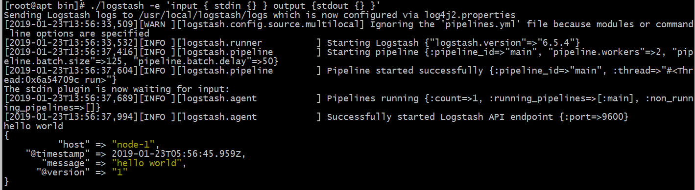

9. 编写一个Logstash启动需要指定的配置文件

   ```bash
   # cat /usr/local/logstash/config/test.conf 
   input {
     stdin {
   
     }
   }
   
   output {
     elasticsearch {
       hosts => "http://10.0.0.179:9200"
       index => "test-%{+YYYY.MM.dd}"
     }
   
    stdout {
     codec =>rubydebug
    }
   }
   ```

10. 指定配置文件启动Logstash

    ```bash
    # cd /usr/local/logstash/
    # ./logstash -f ../config/test.conf
    ```

     

11. 暂无


#### 安装Kibana

1. 进入官网Kibana的下载页面，获取tar.gz包的下载连接

2. 在服务器中使用wget下载包

   ```bash
   # wget -O /usr/local/src/kibana.tar.gz https://artifacts.elastic.co/downloads/kibana/kibana-6.5.4-linux-x86_64.tar.gz
   ```

3. 解压

   ```bash
   # mkdir -p /usr/local/kibana && tar xzvf /usr/local/src/kibana.tar.gz -C /usr/local/kibana/ --strip-components 1			
   ```

4. 修改配置文件（使用默认的端口即可，指定0.0.0.0为所有人都能访问，elasticsearch.url填写之前elasticsearch里面配置的url即可）

   ```bash
   # cat /usr/local/kibana/config/kibana.yml          
   server.port: 5601
   server.host: "0.0.0.0"
   elasticsearch.url: "http://47.112.34.66:9200"
   ```

5. 启动进程

   ```bash
   # nohup /usr/local/kibana/bin/kibana &>/dev/null  &
   ```

6. netstat检查一下启动状态

   ```bash
   # netstat -ntlup | grep 5601
   tcp        0      0 0.0.0.0:5601            0.0.0.0:*               LISTEN      14677/node       
   ```

7. 通过浏览器进行 ip:port 访问kibana的web界面

   

8. 如果需要停止kibana进程就执行下面的命令

   ```bash
   # ps aux | grep -v grep | grep /node/bin/node | awk -F " " '{print $2}' | xargs kill -9
   ```

9. 至于kibana的web页面和后续的ELK使用就留在下一章吧


### 多机部署

暂无


​	


## 基础功能测试

### 系统日志采集测试


###　系统日志采集传输汇总测试


### 应用软件日志采集测试


## 五、Elasticsearch使用


集群节点启动时，会通过多播（默认）或单播的方式在9300/tcp查找同一集群岁的其他节点，并与之建立通信。

ES集群中的所有节点会选举出一个主节点负责管理整个集群状态，以及在集群范围内决定各shards的分布方式。站在用户角度而言，每个均可接受并响应用户的各类请求，所以对用户来说，谁是主节点不用在意。


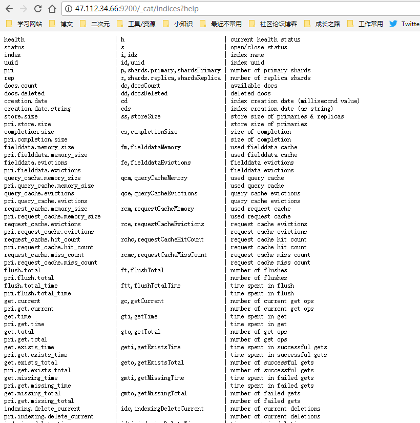


查看节点的健康状态， ?v 则是可以查看健康详情

```bash
# curl http://47.112.34.66:9200/_cat/health
1548736008 04:26:48 elk-application yellow 1 1 16 16 0 0 15 0 - 51.6%
# curl http://47.112.34.66:9200/_cat/health?v
epoch  timestamp cluster status node.total node.data shards pri relo init unassign pending_tasks max_task_wait_time active_shards_percent
1548736015 04:26:55  elk-application yellow    1  1  16  16  0  0  15  0  -  51.6%
```


查看索引的健康状态

curl  -XGET  "http://localhost:9200/_cluster/health/INDEX-NAME"


### APIs

[部分接口列表介绍](http://www.ttlsa.com/elk/elk-elasticsearch-cat-api/)


### ES plugins 管理


### 快照创建与恢复

[ELK elasticsearch 快照与恢复模块](http://www.ttlsa.com/elk/elk-elasticsearch-snapshot-restore/)


## 六、Logstash使用


### input

### filter

- gork

  grok过滤器：
  解析任意文本数据，Grok 是 Logstash 最重要的插件。它的主要作用就是将文本格式的字符串，转换成为具体的结构化的数据，配合正则表达式使用。内置120多个解析语法。

  官方提供的grok表达式：https://github.com/logstash-plugins/logstash-patterns-core/tree/master/patterns
  grok在线调试：https://grokdebug.herokuapp.com/

- 


### output


### Logstash插件（使用）

#### input

- stdin

- file

  从文件系统的文件中读取，类似于 tial -f 命令

- syslog

  在514端口上监听系统日志消息，并根据RFC3164标准进行解析

- tcp

- redis

  从redis service中读取

- beats

  从filebeat中读取

- 


#### codec

- json

  使用json格式对数据进行编码/解码。

- multiline

  将汇多个事件中数据汇总为一个单一的行。比如：java异常信息和堆栈信息。

- multiline

- collectd

- netflow


#### filter

- gork

  解析任意文本数据，Grok 是 Logstash 最重要的插件。它的主要作用就是将文本格式的字符串，转换成为具体的结构化的数据，配合正则表达式使用。内置120多个解析语法。

  官方提供的**grok表达式**：https://github.com/logstash-plugins/logstash-patterns-core/tree/master/patterns

  **grok在线调试**：https://grokdebug.herokuapp.com/

- dissect

- date

- mutate

  对字段进行转换。例如对字段进行删除、替换、修改、重命名等。

- drop

  丢弃一部分events不进行处理

- clone

  拷贝 event，这个过程中也可以添加或移除字段。

- geoip

  添加地理信息(为前台kibana图形化展示使用)

- json

- kv

- metrics

- ruby

- split

- elapsed

- 其他


### output

- elasticsearch

  可以高效的保存数据，并且能够方便和简单的进行查询。

- file

  将event数据保存到文件中。

- graphite

  将event数据发送到图形化组件中，一个很流行的开源存储图形化展示的组件。

- codecs

  **codecs 是基于数据流的过滤器，它可以作为input，output的一部分配置**。Codecs可以帮助你轻松的分割发送过来已经被序列化的数据。具体可以看看codec的插件。

- exec

- email

- nagios

- statsd

- stdout

- tcp

- hdfs

- 其他


如何在启动Logstash时指定配置文件

指定单个文件 `bin/logstash -f agent.conf`  

指定目录下的所有文件 `bin/logstash -f /etc/logstash.d/`


## 七、Beats使用

### Filebeat：日志文件采集

### Metricbeat：指标

### Heartbeat：运行时间监控

### Packetbeat：网络数据采集

### Auditbeat：审计数据

### Winlogbeat：Windows事件日志

### Functionbeat：无需服务器的采集器


## 八、Kibana使用


### kibana web端菜单栏介绍


- discover
- visualize
- dashboard
- timelion
- canvas
- machine learning
- infrastructure
- logs
- apm
- dev tools
- monitoring
- management 
- 


### kibana插件管理

- sense
- 


### kibana登录验证

nginx转发登录验证

http://www.cnblogs.com/configure/p/7607302.html


## ELK的版本升级


## Nginx日志管理实践

&nbsp;       本次实践内容为对nginx进行日志管理的全部操作步骤。


### 安装Nginx

这里直接对nginx进行简易的yum安装即可

```bash
# yum -y install nginx 
```


### 修改Nginx配置文件，启动Nginx

基本不用修改什么内容，添加好server_name就差不多了

启动nginx服务

```bash
# systemctl start nginx 
# systemctl status nginx 
● nginx.service - The nginx HTTP and reverse proxy server
   Loaded: loaded (/usr/lib/systemd/system/nginx.service; disabled; vendor preset: disabled)
   Active: active (running) since Mon 2019-02-11 14:45:02 CST; 1h 27min ago
  Process: 6764 ExecStart=/usr/sbin/nginx (code=exited, status=0/SUCCESS)
  Process: 6759 ExecStartPre=/usr/sbin/nginx -t (code=exited, status=0/SUCCESS)
  Process: 6757 ExecStartPre=/usr/bin/rm -f /run/nginx.pid (code=exited, status=0/SUCCESS)
 Main PID: 6767 (nginx)
   CGroup: /system.slice/nginx.service
           ├─6767 nginx: master process /usr/sbin/nginx
           ├─6768 nginx: worker process
           └─6769 nginx: worker process
```


### 调试grok

​        调试grok是很关键的一步，如果没有能够调试成功，也就不能获取到我们需要的数据，需要根据不同的日志结构来修改grok pattern，才能得到我们真正需要的数据。

1. 先在nginx的日志中，截取一段日志用来进行调试。 

2. 在kibana6.5版本中，Dev tools已经加入了grok debugger，可以直接在这里进行调试。

3. 以下为调试的日志、grok pattern和结果

   log：

   ```
   14.153.187.107 - - [11/Feb/2019:14:45:59 +0800] "GET /favicon.ico HTTP/1.1" 404 3650 "-" "Mozilla/5.0 (Windows NT 6.1; Win64; x64; rv:64.0) Gecko/20100101 Firefox/64.0" "-" 
   ```

   grok pattern：

   ```
   %{IPORHOST:clientip} - %{NOTSPACE:remote_user} \[%{HTTPDATE:timestamp}\] \"(?:%{WORD:verb} %{NOTSPACE:request}(?: HTTP/%{NUMBER:httpversion})?|%{DATA:rawrequest})\" %{NUMBER:response} (?:%{NUMBER:bytes}|-) \"-\" %{QS:agent} \"-\"
   ```

   result （Structured Data）：

   ```json
   {
     "request": "/favicon.ico",
     "agent": "\"Mozilla/5.0 (Windows NT 6.1; Win64; x64; rv:64.0) Gecko/20100101 Firefox/64.0\"",
     "verb": "GET",
     "remote_user": "-",
     "response": "404",
     "bytes": "3650",
     "clientip": "14.153.187.107",
     "httpversion": "1.1",
     "timestamp": "11/Feb/2019:14:45:59 +0800"
   }
   ```


### 编写filebeat配置文件

```bash
# cat /usr/local/filebeat/filebeat.nginx.yml 
filebeat.prospectors:
- type: log
  input_type: log
  paths:
    - /var/log/nginx/access.log
  tags: ["nginx"]
  fields:
    logIndex: nginx
    docType: nginx-access
  fields_under_root: true
  tail_files: false

output.logstash:
  hosts: ["127.0.0.1:5044"]
```

指定好input的类型，output到Logstash


### 编写Logstash配置文件

```bash
# cat /usr/local/logstash/config/nginx_access.conf 
input {
    beats {
        port => 5044
    }
}

filter {
    grok {
        match => { "message" => "%{IPORHOST:clientip} - %{NOTSPACE:remote_user} \[%{HTTPDATE:timestamp}\] \"(?:%{WORD:verb} %{NOTSPACE:request}(?: HTTP/%{NUMBER:httpversion})?|%{DATA:rawrequest})\" %{NUMBER:response} (?:%{NUMBER:bytes}|-) \"-\" %{QS:agent} \"%{DATA:x_forwarded_for}\"" }
        remove_field => "message"
    }
}

output {
    elasticsearch {
        hosts => ["127.0.0.1:9200"]
        index => "test-nginx-%{type}-%{+YYYY.MM.dd}"
        document_type => "%{type}"
    }
    stdout { codec => rubydebug }
}
```

input指定为来自beats的日志，filter中指定grok插件，match的添加好之前调试好的grok pattern，然后移除掉"message"，避免重复信息，output指定输出到elasticsearch中去。

output中的index为指定索引，这里是按每天的日志建立不同的索引。


### 启动filebeat

进入filebeat的安装目录，直接前台启动，方便测试

```bash
# cd /usr/local/filebeat/
# ./filebeat -c filebeat.nginx.yml
```


### 启动Logstash

指定配置文件为 filebeat.nginx.yml 启动Logstash，让Logstash直接在前台运行方便查看结果

```bash
# cd /usr/local/logstash/
# ./bin/logstash -f config/nginx_access.conf 
```

再次访问nginx后可以看到Logstash这边生成了新的信息

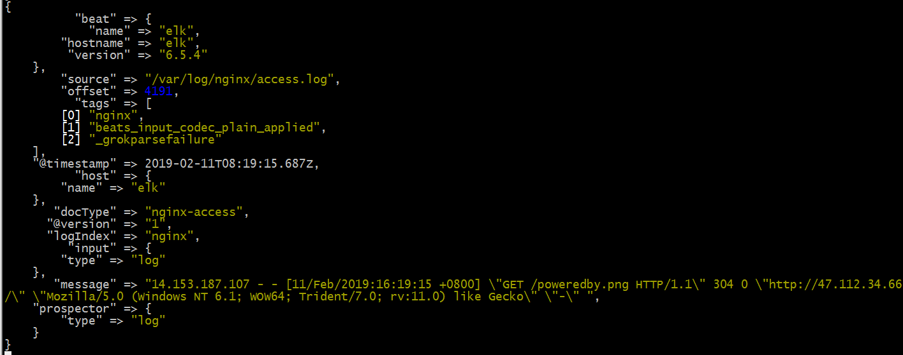


### 查看elasticsearch是否生成了索引

在使用客户端访问nginx后，会在服务器自动生成log，然后如果成功了的话，会在elasticsearch中按配置文件指定的格式自动生成索引，所以可以通过直接查看elasticsearch是否有自动生成索引来查看是否成功。

```bash
# curl http://127.0.0.1:9200/_cat/indices?v | grep test-nginx
  % Total    % Received % Xferd  Average Speed   Time    Time     Time  Current
                                 Dload  Upload   Total   Spent    Left  Speed
100  1270  100  1270    0     0  74486      0 --:--:-- --:--:-- --:--:-- 79375
yellow open   test-nginx-%{type}-2019.02.12   OJ-I1_naTlyOx43ARtryGQ   5   1          4            0       460b           460b
yellow open   test-nginx-%{type}-2019.02.11   APn-Hh1qQXeWGiDL0DiK7Q   5   1         63            0    485.1kb        485.1kb
```

根据上述的查看结果，可以看到已经自动生成了test-nginx-%{type}-2019.02.11和 test-nginx-%{type}-2019.02.12这两个索引 （P.S.今天为2019.02.12）


### 在kibana创建index

1. 打开kibana的web地址后，按顺序打开：`management`→`kibana`→`index pattern`→`create index pattern`

2. 在index pattern的匹配框里面填入`test-nginx-*`就可以匹配到所有以test-nginx-开头的index

   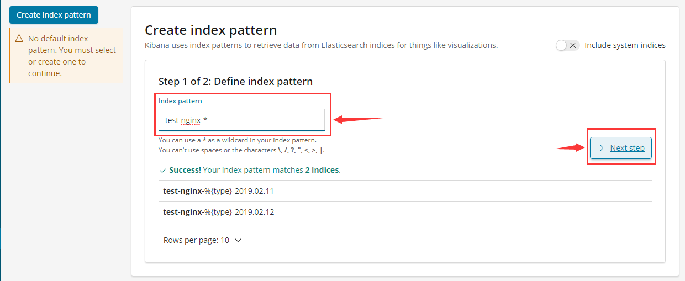

3. 选择@timestamp后创建

   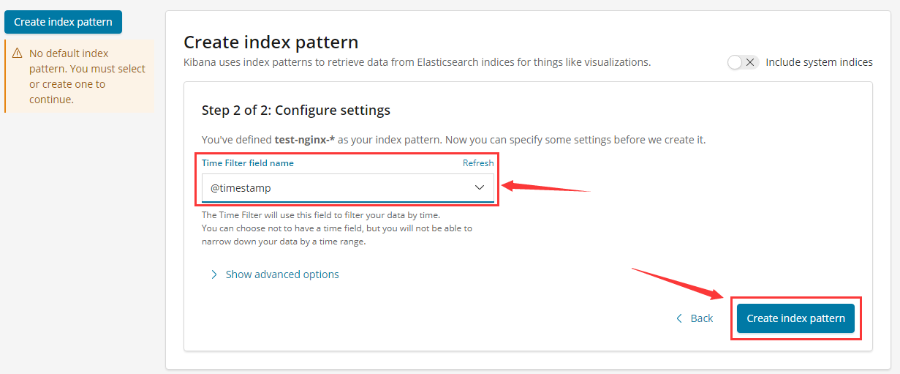


### 在kibana的discover查看结果

创建好之后就可以直接在kibana的discover中查看结果，能够直观的查看到不同时间产生的日志数量以及日志信息

如下图所示：

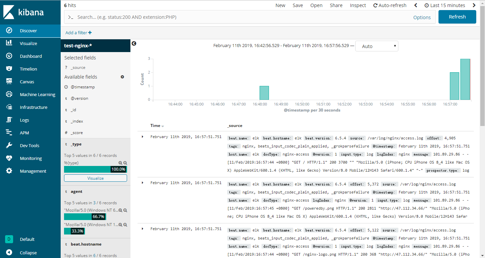


还能查看详细的字段：

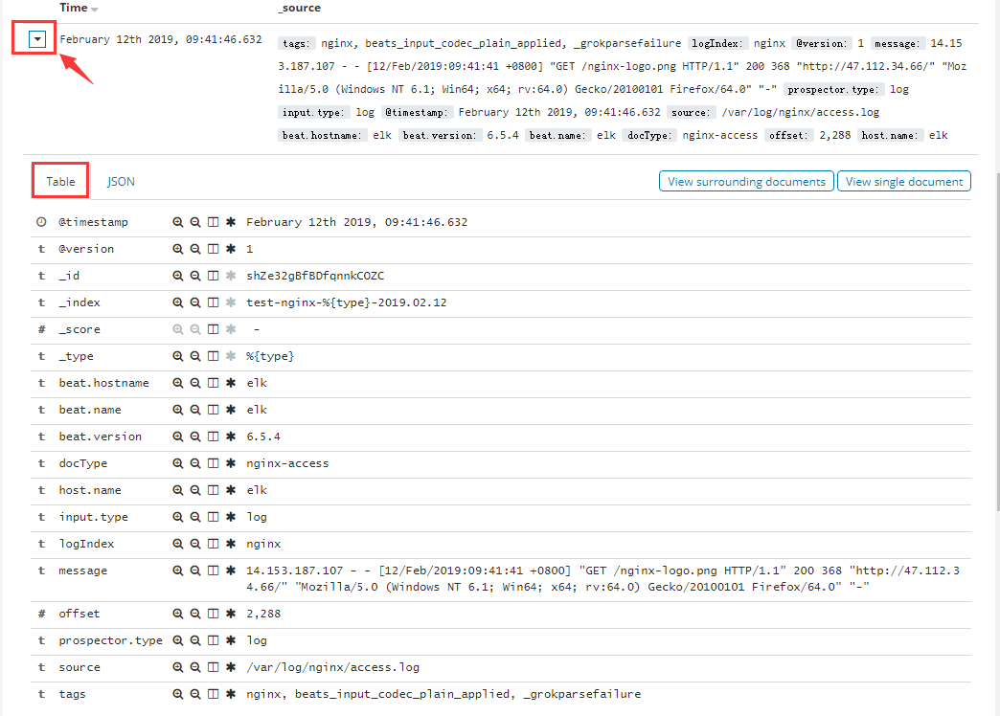


也能查看json格式的结构化数据：

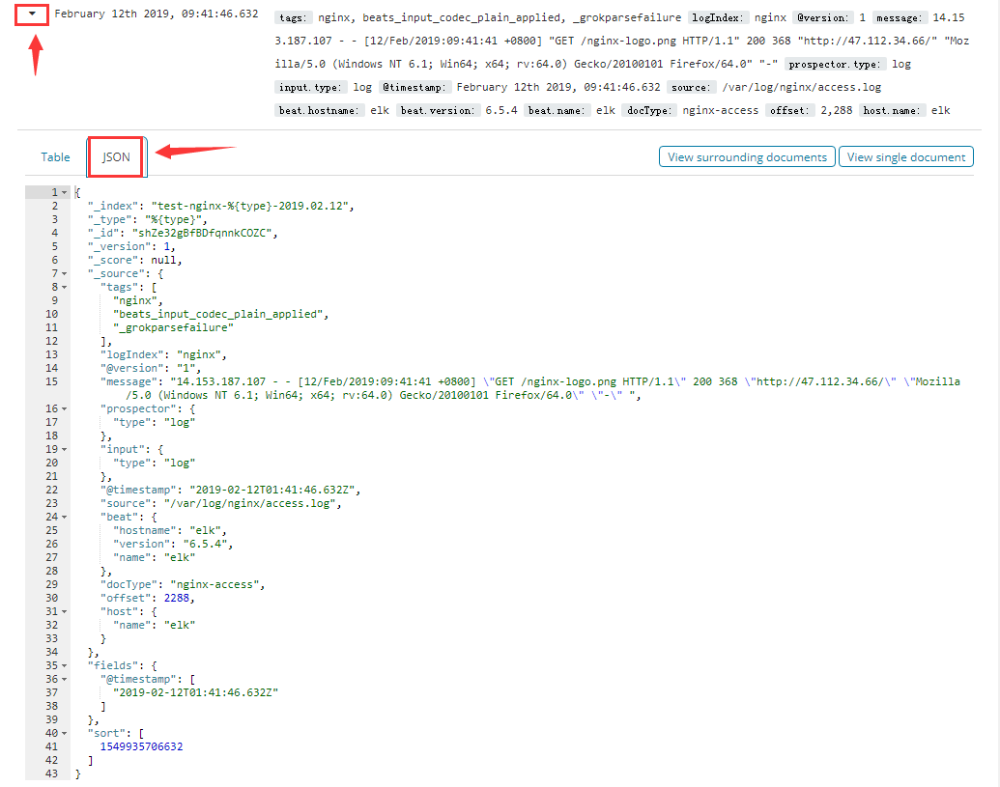


## *遇到的问题汇总

### 启动elasticsearch失败

**问题描述：**

在使用tar包安装好elasticsearch之后，进行启动，发现执行完 ./elasticsearch 这个命令之后，会马上就`Exit `，启动失败，启动失败界面如下图所示（图示使用的为root用户执行命令是因为使用elasticsearch用户执行也是一样的，所以后续尝试了一下root用户执行，报出的信息都是一样的，所以就直接使用这个截图了）：

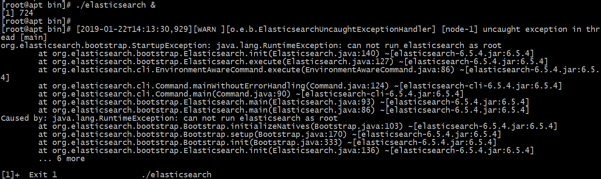

**问题原因：**

遇到这个问题后借助百度检索，看到 http://www.mamicode.com/info-detail-1865356.html 这里也有一位朋友遇到了和我一样的问题，他说明的原因是：`因为lasticsearch自5版本之后，处于安全考虑，不允许使用root用户运行`。回想一下，是因为之前在修改elasticsearch.yml配置文件的时候，path.data与path.logs指定目录都是新创建在/data/elasticsearch目录下，结果在创建好elasticsearch用户授权目录的时候，只授权了**/data/elasticsearch**而忽略了elasticsearch的安装目录，所以使用启动命令的时候还是使用了root用户，所以启动失败了。

**解决方法：**

再给elasticsearch的安装目录进行elasticsearch用户授权即可。


### elasticsearch配置文件的IP地址换成外网地址启动失败

**问题描述：**

今天测试了一下把elasticsearch配置文件的IP地址换成外网地址，打算在自己的浏览器上直接浏览查看一下，结果发现好像并不能启动。后来想是不是因为忘记修改hosts文件了，不过改了hosts文件之后发现还是不行，目前还没有发现到底是什么原因。

**解决方法：**

通过修改elasticsearch.yml配置文件的IP地址来解决，把访问IP地址指定为0.0.0.0就可以都能访问了，我开始以为这个ip地址的意思是指定被访问IP地址，所以一直填写外网IP后想启动elasticsearch然后访问这个IP地址，结果每次都会启动失败。

修改的配置文件内容如下：

```bash
# cat /usr/local/elasticsearch/config/elasticsearch.yml
cluster.name: elk-application
node.name: node-1
path.data: /data/elasticsearch/data
path.logs: /data/elasticsearch/logs
network.host: 0.0.0.0
http.port: 9200
discovery.zen.ping.unicast.hosts: ["node-1"]
discovery.zen.minimum_master_nodes: 1
```

切换到elasticsearch用户启动elasticsearch后，再用本地浏览器去访问我的云服务器即可。

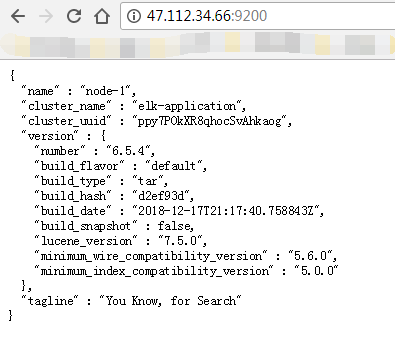


### 指定conf文件启动Logstash失败

**问题描述：**

在指定了配置文件启动Logstash之前，编辑好配置文件如下（按照博客写的操作）：

```bash
# vim /usr/local/logstash/config/test.conf
input {
    beats {
      port => "5044"
    }
}
output {
    elasticsearch {
      hosts => "10.0.0.179:9200"
    }
    stdout { codec => rubydebug }  # 这是将输出打印在屏幕上，可以注释掉
}　
```

但是启动会出现报错，报错如下：

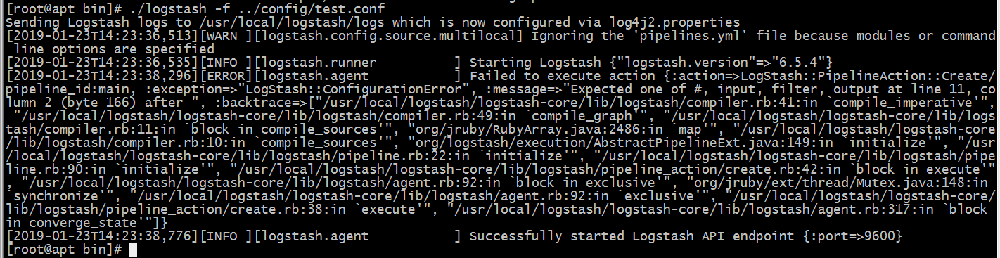

使用-t参数进行检查：

```bash
# ./logstash -f ../config/test.conf -t 
Sending Logstash logs to /usr/local/logstash/logs which is now configured via log4j2.properties
[2019-01-23T17:34:00,487][WARN ][logstash.config.source.multilocal] Ignoring the 'pipelines.yml' file because modules or command line options are specified
[2019-01-23T17:34:01,182][FATAL][logstash.runner          ] The given configuration is invalid. Reason: Expected one of #, input, filter, output at line 11, column 2 (byte 155) after 
[2019-01-23T17:34:01,202][ERROR][org.logstash.Logstash    ] java.lang.IllegalStateException: Logstash stopped processing because of an error: (SystemExit) exit
```


**解决方法：**

连检查配置文件都报错了，初步判断这次error的出现和配置文件的关系挺大，于是打算另外参考一篇博客来进行修改，于是重新修改了配置文件，改成了下面的内容：

```bash
# cat /usr/local/logstash/config/test.conf 
input {
  stdin {
  }
}

output {
  elasticsearch {
    hosts => "http://10.0.0.179:9200"
    index => "test-%{+YYYY.MM.dd}"
    #user => "elastic"
    #password => "changeme"
  }
 stdout {
  codec =>rubydebug
 }
}
```

这次使用 -t 参数检查配置文件，并没有报错了，但是指定这个配置文件启动Logstash的话，还是一样会继续报错

--分割线--

好吧...  成功了，之前都还是报错的，现在执行了一遍居然成功了，突如其来的惊喜，但是这其实不是我太想要的结果，因为这次的成功感觉有很多的偶然因素，而且之后还不一定都能像现在这样能够成功

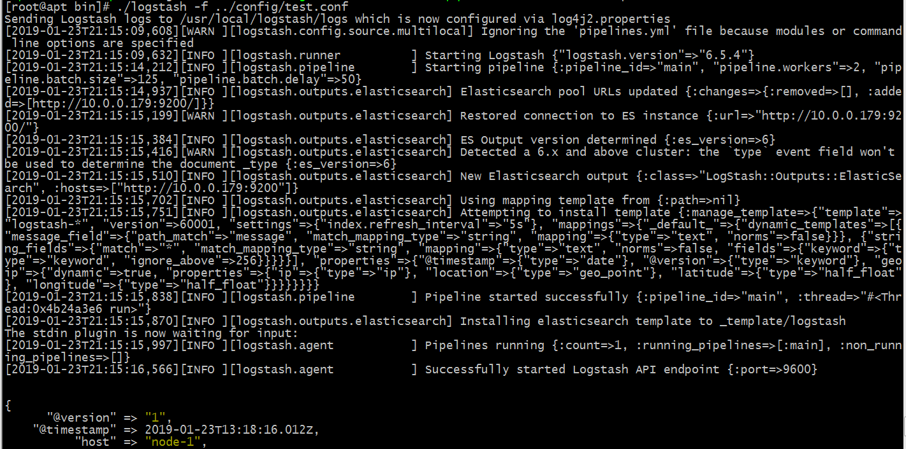


## Q&A

### Q：是否能够支持Windows系统的系统日志采集？

A：


### Q：是否能够支持windows系统的应用日志采集？

A：


## *疑问汇总

### elasticsearch配置文件指定的data目录权限问题

**问题描述：**

在安装elasticsearch的时候需要指定**path.data**与**path.logs**的路径，然后我在考虑的一个问题是这两个目录可能会存放大量的文件，所以我想着单独创建了一个 **/data/elasticsearch** 准备用来单独存放可能比较大量的文件，结果后来进行elasticsearch授权的时候只给这个目录，所以导致我启动elasticsearch失败，后来在想，如果不给这个目录进行elasticsearch授权，之后启动了elasticsearch后，那些需要存放到这个路径下的文件会受影响吗？

**解答：**

经过测试，取消给/data/elasticsearch进行elasticsearch用户授权之后，也会一样的启动elasticsearch失败，测试结论为如果不给**path.data**与**path.logs**指定的目录进行elasticsearch授权的话也一样无法启动elasticsearch。


### elasticsearch端口的疑问

**问题描述：**

使用netstat命令查看了一下端口开发情况如下：

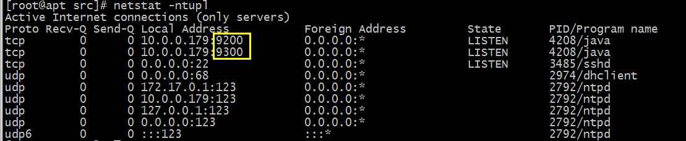

这下有两个疑问，一个是在配置文件指定的9200是官方指定的默认端口吗？在配置文件里面修改这个端口会有什么问题吗？或者说之后和其他的开源组件一起工作的时候，会不会因为修改了端口而造成一些其他的问题呢？第二个问题是为什么还有一个9300端口也开放了呢？

**解答：**

9200是官方指定的默认elasticsearch端口，这个也是可以自行修改的，不会产生任何影响，在一篇博客看到使用单机多实例elasticsearch部署就是通过指定不同的端口来实现的，这让我想起了以前做多实例的MySQL也是这样通过端口来实现的。


### filter的date插件使用相关问题

**问题描述：**

在 https://elkguide.elasticsearch.cn/logstash/plugins/filter/date.html 这里所提到的一个事例：`写一个 Joda 时间格式的配置`

```
filter {
    grok {
        match => ["message", "%{HTTPDATE:logdate}"]
    }
    date {
        match => ["logdate", "dd/MMM/yyyy:HH:mm:ss Z"]
    }
}
```

为什么这个match里面写的是 MMM，为什么是3个M呢？月份一般情况不是2个M就行了吗？

**解答：**

两个M是数字的月份才会使用两个M，但是如果是英文的月份呢？想想是不是例如Jan这样，这种就有3个字符了，所以就是3个M

引用一段nginx的日志，看看时间那一段内容，就很明显了。 30/**Jan**/2019:13:37:12 +0800

> 191.23.114.79 - - [30/Jan/2019:13:37:12 +0800] "GET / HTTP/1.1" 200 3700 "-" "Mozilla/5.0 (Windows NT 10.0; WOW64) AppleWebKit/537.36 (KHTML, like Gecko) Chrome/51.0.2704.103 Safari/537.36" "-" 0.000


### 关于采集docker日志的docker日志输出的问题

**问题描述：**

在书上，有提到容器比较特殊，是没有 /dev/stdout 设备的，所以需要单独处理一下，在dockerfile里加上一句：

`RUN ln -sf /proc/self/fd  /dev/`

那么这一段内容代表的是什么意思呢？  是特别的指定一下把某些文件或者内容放入到指定的位置里去吗？


## 参考文档/文献

 - [ELK原理与介绍](https://www.cnblogs.com/aresxin/p/8035137.html)
 - [ELKstack中文指南](https://elkguide.elasticsearch.cn/)
 - [ELK 日志服务器安装部署](http://blog.51cto.com/wuguiyunwei/1931623)
 - [CentOS7单机部署ELK](https://www.linuxidc.com/Linux/2017-11/148222.htm)
 - [elk中elasticsearch安装启动失败](http://www.mamicode.com/info-detail-1865356.html)
 - [elasticsearch集群搭建实例](https://www.linuxidc.com/Linux/2015-02/114243.htm)
 - [ELK-6.4.2 单机多实例部署实践](https://blog.csdn.net/qq_16038125/article/details/82953556)
 - [ELK elasticsearch 核心术语(2nd)](http://www.ttlsa.com/elk/elk-elasticsearch-core-concept/)
 - [Logstash grok使用案例](http://www.mamicode.com/info-detail-1359018.html)
 - [利用ELK系统分析Nginx日志并对数据进行可视化展示](https://www.cnblogs.com/hanyifeng/p/5857875.html)


