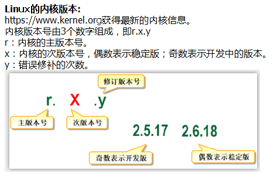

# 系统描述


### Author

```txt
Name:Shinefire
Blog:
E-mail:czy@clinux.cn
```


> 本章节主要是描述了一下Linux操作系统的一些特性，让大家对Linux操作系统有个比较初步的了解


---

### Linux是什么？

​	Linux是一种自由和开放源代码的类UNIX操作系统，该操作系统由内核再加上用户空间的应用程序就成了Linux操作系统。严格来讲，Linux只是操作系统内核本身，但通常采用“Linux内核”来表达该意思。而Linux通常来指基于Linux内核的完整操作系统，它包括GUI组件和许多其他实用工具。

​	P.S. 参考了《循序渐进Linux》一书的描述内容


---

### Linux系统的组成部分

**Linux 内核**

​	内核是操作系统的核心，具有很多最基本功能，如虚拟内存、多任务、共享库、需求加载、可执行程序和TCP/IP网络功能。Linux内核的模块分为以下几个部分：存储管理、CPU和进程管理、文件系统、设备管理和驱动、网络通信、系统的初始化和系统调用等。

​	另外以前

**Linux shell**

​	shell是系统的用户界面，提供了用户与内核进行交互操作的一种接口。它接收用户输入的命令并把它送入内核去执行，是一个命令解释器。另外，shell编程语言具有普通编程语言的很多特点，用这种编程语言编写的shell程序与其他应用程序具有同样的效果。

**Linux文件系统**

​	文件系统是文件存放在磁盘等存储设备上的组织方法。Linux系统能支持多种目前流行的文件系统，如EXT2、EXT3、FAT、FAT32、VFAT和ISO9660。

**Linux应用程序**

​	标准的Linux系统一般都有一套都有称为应用程序的程序集，它包括文本编辑器、编程语言、XWindow、办公套件、Internet工具和数据库等。


---

### Linux内核


**Linux内核版本**



---

### Linux系统发行版


**查看Linux系统发行版**

1. 通用查看内核发行版的方式

   ```bash
   [root@apt ~]# lsb_release -a 
   LSB Version:    :core-4.1-amd64:core-4.1-noarch
   Distributor ID: CentOS
   Description:    CentOS Linux release 7.3.1611 (Core) 
   Release:        7.3.1611
   Codename:       Core
   ```

2. 红帽系通用的查看方式

   ```bash
   # cat /etc/redhat-release 
   CentOS Linux release 7.3.1611 (Core) 
   ```


---

### 目录树介绍

> 本节复制了W3Cschool中Linux教程的相关内容

**树状目录结构**


**各个目录的解释**

- /bin：
   bin是Binary的缩写, 这个目录存放着最经常使用的命令。

- /boot：
  这里存放的是启动Linux时使用的一些核心文件，包括一些连接文件以及镜像文件。

- /dev ：
  dev是Device(设备)的缩写, 该目录下存放的是Linux的外部设备，在Linux中访问设备的方式和访问文件的方式是相同的。

- /etc：
  这个目录用来存放所有的系统管理所需要的配置文件和子目录。

- /home：
  用户的主目录，在Linux中，每个用户都有一个自己的目录，一般该目录名是以用户的账号命名的。

- /lib：
  这个目录里存放着系统最基本的动态连接共享库，其作用类似于Windows里的DLL文件。几乎所有的应用程序都需要用到这些共享库。

- /lost+found：
  这个目录一般情况下是空的，当系统非法关机后，这里就存放了一些文件。

- /media linux系统会自动识别一些设备，例如U盘、光驱等等，当识别后，linux会把识别的设备挂载到这个目录下。

- /mnt：
  系统提供该目录是为了让用户临时挂载别的文件系统的，我们可以将光驱挂载在/mnt/上，然后进入该目录就可以查看光驱里的内容了。

- /opt：
   这是给主机额外安装软件所摆放的目录。比如你安装一个ORACLE数据库则就可以放到这个目录下。默认是空的。

- /proc：
  **这个目录是一个虚拟的目录，它是系统内存的映射**，我们可以通过直接访问这个目录来获取系统信息。
  **这个目录的内容不在硬盘上而是在内存里**，我们也可以直接修改里面的某些文件，比如可以通过下面的命令来屏蔽主机的ping命令，使别人无法ping你的机器：
  echo 1 > /proc/sys/net/ipv4/icmp_echo_ignore_all

- /root：
  该目录为系统管理员，也称作超级权限者的用户主目录。

- /sbin：
   s就是Super User的意思，这里存放的是系统管理员使用的系统管理程序。

- /selinux：（一般不会有这个目录）
   这个目录是Redhat/CentOS所特有的目录，Selinux是一个安全机制，类似于windows的防火墙，但是这套机制比较复杂，这个目录就是存放selinux相关的文件的。

- /srv：
   该目录存放一些服务启动之后需要提取的数据。

- /sys：
   这是linux2.6内核的一个很大的变化。该目录下安装了2.6内核中新出现的一个文件系统 sysfs 。
    sysfs文件系统集成了下面3种文件系统的信息：针对进程信息的proc文件系统、针对设备的devfs文件系统以及针对伪终端的devpts文件系统。该文件系统是内核设备树的一个直观反映。
    当一个内核对象被创建的时候，对应的文件和目录也在内核对象子系统种被创建。

- /tmp：
  这个目录是用来存放一些临时文件的。

- /usr：
   这是一个非常重要的目录，用户的很多应用程序和文件都放在这个目录下，类似与windows下的program files目录。

- /usr/bin：
  系统用户使用的应用程序。

- /usr/sbin：
  超级用户使用的比较高级的管理程序和系统守护程序。

- /usr/src：内核源代码默认的放置目录。

- /var：
  这个目录中存放着在不断扩充着的东西，我们习惯将那些经常被修改的目录放在这个目录下。包括各种日志文件。


**注意事项：**

在linux系统中，有几个目录是比较重要的，平时需要注意不要误删除或者随意更改内部文件。

/etc： 上边也提到了，这个是系统中的配置文件，如果你更改了该目录下的某个文件可能会导致系统不能启动。

/bin, /sbin, /usr/bin, /usr/sbin: 这是系统预设的执行文件的放置目录，比如 ls 就是在/bin/ls 目录下的。

值得提出的是，/bin, /usr/bin 是给系统用户使用的指令（除root外的通用户），而/sbin, /usr/sbin 则是给root使用的指令。

/var： 这是一个非常重要的目录，系统上跑了很多程序，那么每个程序都会有相应的日志产生，而这些日志就被记录到这个目录下，具体在/var/log 目录下，另外mail的预设放置也是在这里。


---

### Linux中的三大类设备

1. 字符设备：以字符为单位进行输入输出的设备。 如：打印机，显示终端等。  
2. 块设备：以数据块为单位进行输入输出的设备。如：磁盘，光盘。
3. 网络设备：以数据包为单位进行数据交换的设备。如：以太网卡等。


