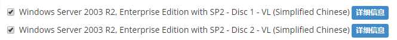
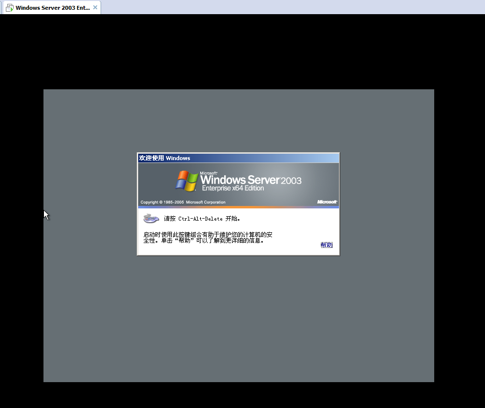
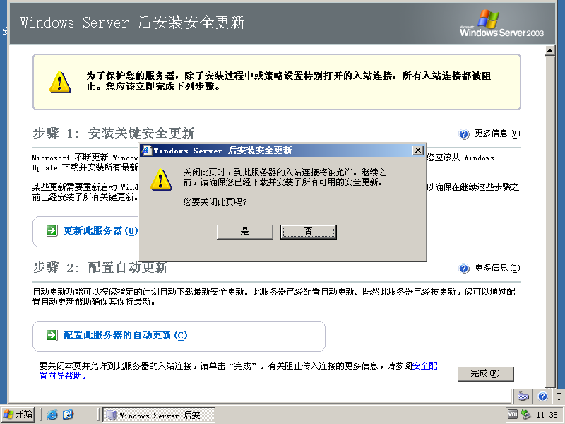

# Windows Server Install

> 本章节主要是介绍了windows server的安装，条件有限，我是用vmware workstations来进行虚拟机安装的

[TOC]

---

### VMware workstations 14 安装

如果要使用虚拟机来安装 windows server 的话，首先要在自己的电脑上安装一个 VMware workstations 才行。

VMware workstations 14 的安装这里就不多说了，可以自己去网上找教程，建议还是不要用太新的版本，用个什么12版本我觉得就挺不错的了。

附一个网上的博客吧，关于 `VMware Workstation 14 中文破解版安装` 的博客。

<https://blog.csdn.net/u014225733/article/details/81007264>

---

### 安装 Windows Server 2003 R2 企业版 虚拟机

#### Windows Server 2003 R2 企业版 镜像下载

我使用的镜像是直接在 <https://msdn.itellyou.cn/> 这个网站找的，相信很多人都知道这个网站了。

**下载地址**（把这个ed2k:.... 这一串复制到百度网盘就可以直接保存下载了）：

cn_win_srv_2003_r2_enterprise_with_sp2_vl_cd1_X13-46432.iso  `ed2k://|file|cn_win_srv_2003_r2_enterprise_with_sp2_vl_cd1_X13-46432.iso|637917184|284DC0E76945125035B9208B9199E465|/`

cn_win_srv_2003_r2_enterprise_with_sp2_vl_cd2_X13-13895.iso

`ed2k://|file|cn_win_srv_2003_r2_enterprise_with_sp2_vl_cd2_X13-13895.iso|129703936|512C89A5839FFC8A3F3124ACB9E9CB75|/`

#### Windows Server 2003 R2 企业版 可用密钥

**MR78C-GF2CY-KC864-DTG74-VMT73**

此密钥亲测可用，如果这个失效了的话，就再自己找找吧

#### Windows Server 2003 R2 企业版 虚拟机安装

> 以我的VMware workstations 14 pro 为例简单说明一下步骤吧

1. 打开VMware workstations

2. 点击 文件→新建虚拟机→选择自定义后下一步→下一步→选择ISO文件后下一步→输入产品密钥后下一步→编辑好虚拟机名称和位置后下一步→配置好处理器下一步→配置好虚拟机的存后下一步→默认选择NAT网络下一步（桥接模式可用直接上网）→下一步→下一步→下一步→设置好磁盘容量下一步→选择好磁盘文件位置下一步→下一步。  然后坐等吧...

3. 可用看到已经进入到开机界面了

   

4. 按 ctrl+alt+del 即可登录进去，因为我没有设置密码，输入账户密码就可用免了，直接点确定就进去了

5. 进去后还会自动装一下东西，慢慢等吧

6. 自动重启后好像进去就会提示更新之类，这个应该关系不大，先确定吧 

   

7. emmmm... 讲真，后续配置我也没有配置过，就先不写系统配置之类的了...  算是安装完了，对吧，哈哈

---

### 安装 Windows Server 2008 R2 企业版 虚拟机

待写

---

### 安装 Windows Server 2012 R2 企业版 虚拟机

待写

